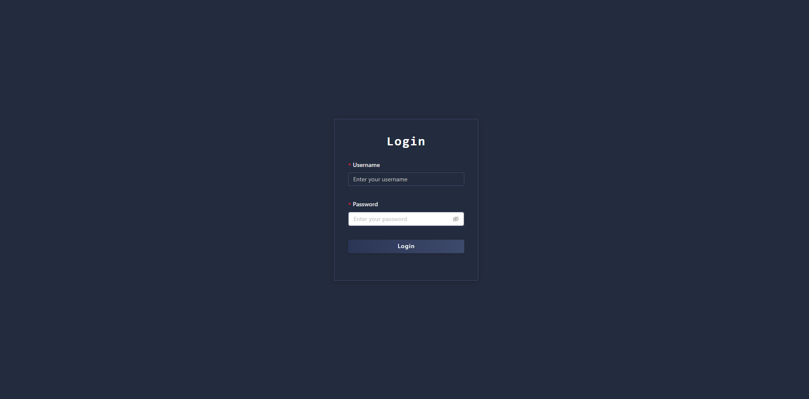
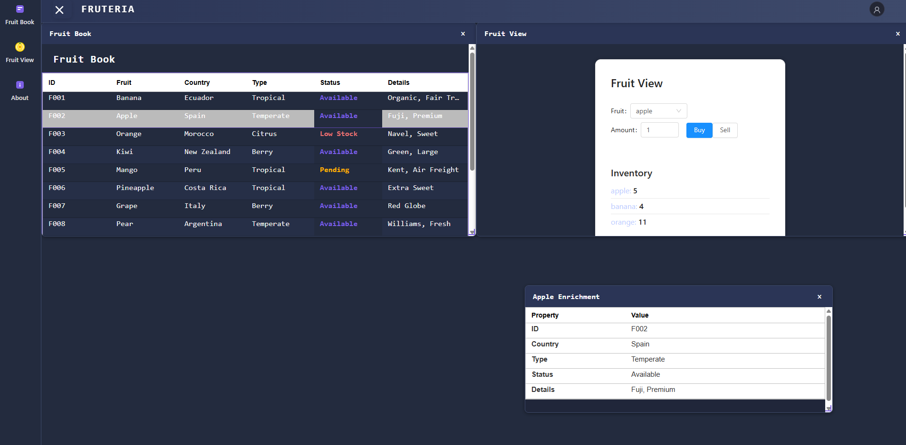
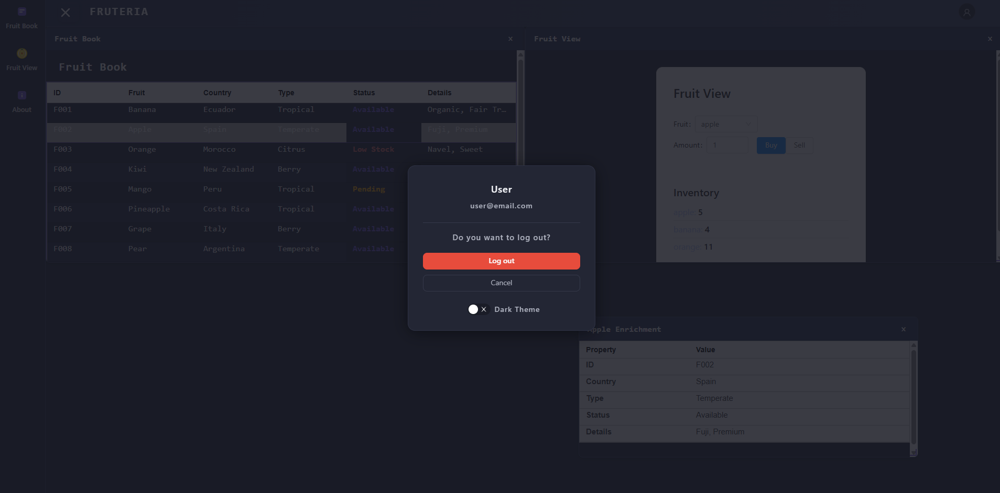

# 🍌 Code Fruteria 🍎

Welcome to the juiciest repo on GitHub! This is your backstage pass to a mock login system and the world’s first* digital fruit trading floor. (*Probably.)

> **Note:** This project runs best on **Node.js v16.14.2**.  
> If you’re using a different version, you might end up with banana peels in your stack trace.

## 🥝 Getting Started

1. **Install dependencies**  
   _(Don’t worry, no actual fruit required.)_
   ```bash
   npm install
   ```

2. **Start the development server**  
   _(Let the fruit fiesta begin!)_
   ```bash
   npm run start
   ```

## 🍊 Mock Login

- Check out `auth/mockLogin.ts` for a taste of our authentication magic.
- Exports a `mockLogin` function that pretends to check your credentials.
- Try logging in as:
  - **admin** / **1234**
  - **user** / **password**
- _Yes, our security is softer than an overripe peach. Maybe engineers should take security a bit more seriously?_
- **Bonus:** If you want to show off your fullstack skills, build a real backend for authentication (Node.js or your favorite language) and earn extra fruit salad points!
- _P.S.: Feel free to use AI tools like **Amazon Q**, **GitHub Copilot**, or your favorite code assistant to help you out!_

---

# 🍇 Code Fruit Challenge

This repo is a stripped-down, vitamin-packed version of the code-fruit project. It’s got just enough pulp to get you started.

🎉 **Calling all code wizards and fruit fanatics!** 🍌🍎

Ever dreamed of trading apples for bananas like a Wall Street pro? Now’s your chance!  
This app lets you swap strawberries for pineapples and pretend you’re the Gordon Gekko of the produce aisle. 🍍📊

But, like a forgotten banana, things have gotten a little… mushy:

- The codebase is a bit overripe and needs a refactor.
- We’re stuck on React 16—let’s peel up to React 18 (and maybe even React 19 if you’re feeling wild).
- The light theme could be fresher than a lemon on a summer day.
- There’s more juicy work to do, but let’s not bite off more than we can chew.
- _Some files are just lying around unused—let’s clean up the codebase and compost the leftovers!_

Who’s ready to modernize this digital fruit bazaar? 🍇💻





## 🍉 Acceptance Criteria

- Upgrade the project to **React 18**.  
  - Upgrading to **React 19** is a bonus, but React 18 is your first pit stop.
- Add **unit tests** before you start refactoring. (No squishy bugs allowed!)
- Upgrade all dependencies so they play nicely with React 18 (or 19, if you’re feeling zesty).
- Update both the **light** and **dark** themes—make them so fresh you’ll need sunglasses.
- **Fix the drag and drop for panels**—right now, it’s more slippery than a watermelon seed.
- **Tame the panel resizing**—currently, it’s wilder than a runaway grape.
- **Upgrade the grid/layout** so panels can go horizontal, vertical, or do the cha-cha for better visual combos.
- **Fix the theme switch** (light/dark)—right now, it’s more confused than a kiwi in a fruit salad.

---

🍏 **Ready to squeeze the most out of this repo? Fork it, juice it, and make it your own!**
